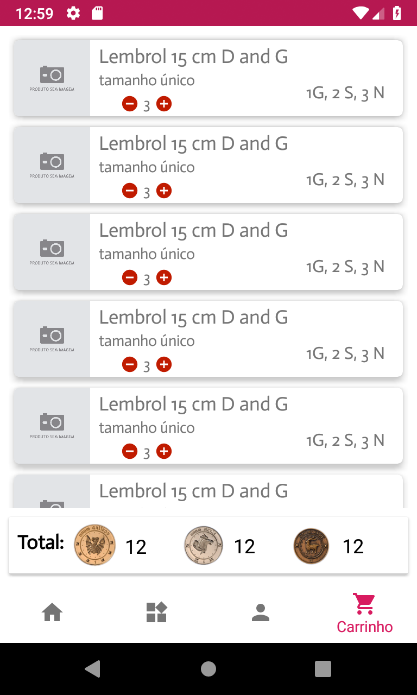

  

 
 

### Sobre
Bruxos britânicos após a queda de Voldemort se tornaram muito mais próximos da comunidade trouxa como resposta natural de rechaçamento aos profundos ideias anti-trouxa dos seguidores do terrível lorde das trevas. Com isso, começaram a gozar de muitas das tecnologias e facilidades que a comunidade trouxa desenvolveu. Quando smartphones se tornaram febre na comunidade não-mágica, bruxos se renderam às facilidades desses dispositivos engenhosos. Observando esse nicho de mercado surgiu o Swish&Flick, um aplicativo de compra online de diversos artigos mágicos. Compre tudo o que poderia encontrar na loja física. Nenhum swish ou flick é necessário. Aproveite.

<h3 align="center">Swish&Flick em construção...</h3>

### Features
- [x] adição de produtos
- [x] visualização de produtos
- [x] categorização dos produtos
- [ ] realização da compra
- [ ] busca

### Tecnologias utilizadas
<ul>
  <li>Linguagem de programação Java</li>
  <li>Firebase Database - banco de dados não-relacional</li>
  <li>Firebase Storage - para armazenamento de imagens</li>
  <li>Glide - para dowload de imagens</li>
</ul>

### Demonstração do app

  <kbd>
    
  </kbd>
  &nbsp;&nbsp;&nbsp;&nbsp;
  <kbd>
    
  </kbd>
  &nbsp;&nbsp;&nbsp;&nbsp;
  <kbd>
    
  </kbd>
  &nbsp;&nbsp;&nbsp;&nbsp;
  <kbd>
    
  </kbd>
  &nbsp;&nbsp;&nbsp;&nbsp;
  <kbd>
    
  </kbd>

### Autor

 

Feito com carinho por Joanderson Gonçalves =}
  
E-mail: <a href="mailto:joandersongsantos@yahoo.com">joandersongsantos@yahoo.com</a>
 
Perfil no <a href="https://www.linkedin.com/in/joanderson-gonçalves-1055351b9">LinkedIn</a>
